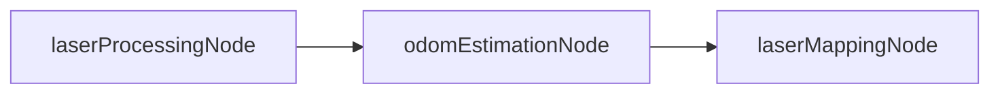
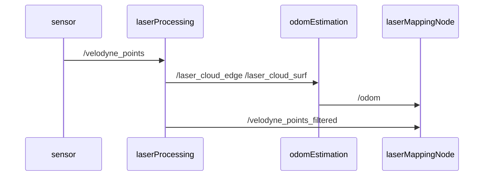

# F-LOAM

## 整体概率

### 各文件功能

- lidar ：设置了一些参数
- lidarOptimization ： 优化，采用 Ceres，在 odomEstimationClass 中使用
- laserProcessing
    - laserProcessingClass.h\laserProcessingClass.cpp : 点云处理的核心函数
    - laserProcessingNode.cpp : 节点函数
- odomEstimation
    - odomEstimationClass.h\odomEstimationClass.cpp : 里程计估计的核心函数
    - odomEstimationNode.cpp : 节点函数
- laserMapping
    - laserMappingClass.h\laserMappingClass.cpp : 建图的核心函数
    - laserProcessingNode.cpp : 节点函数

### 代码顺序

### 话题传递

## 个人小结

### 2.22-5-19

粗略的看了一边，大体的流程差不多了解，与 LOAM 相比，一些关键的东西是差不多的，但是相对而言更加简单一些。

已经不是第一次接触这种代码风格了，个人比较喜欢这种代码风格，内容分布的仅仅有条，对读者是友好的。

没有对代码进行注释，其实还是比较通俗易懂的。

更深一步的理解不敢多说，等深挖之后再写一下。

